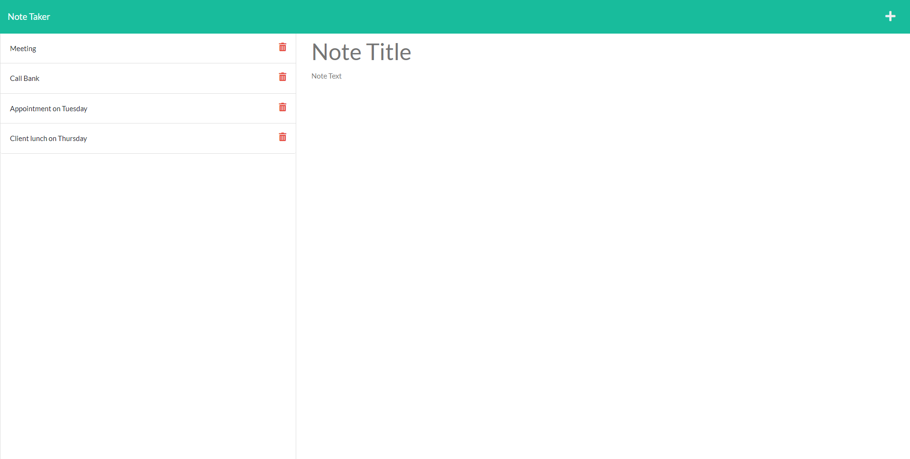
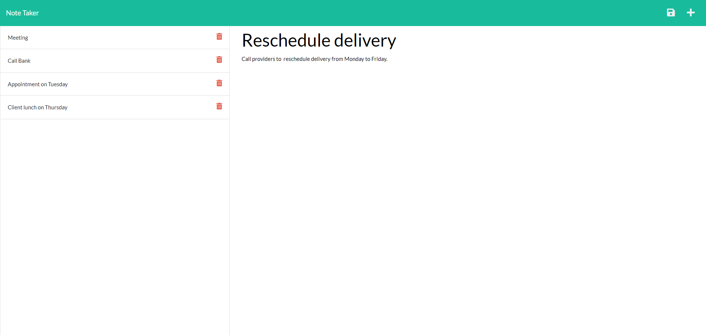

# Note-Taker 

  ## Description
   An application called Note Taker that can be used to write and save notes. 
   
   This application will use an Express.js back end and will save and retrieve note data from a JSON file.

  ## Tables of Contents
  * [Technologies](#technologies)
  * [Instalation](#instalation)
  * [Usage](#usage)
  * [License](#license)
  * [Contributing](#contributing)
  * [Tests](#tests)
  * [Questions](#questions)
   
  ## Technologies

  - HTML                
  - CSS                 
  - JavaScript          
  - Bootstrap          
  - Git
  - NodeJs
  - Express.js
  - NPM
   
  ## Instalation

   The application deployed on Heroku and a link to deployed app is here: [note-taker-app-sb](https://git.heroku.com/note-taker-app-sb.git)

   

  ## Usage
   
   The following images show the web application's appearance and functionality:

   

   
  
  ## License

   For information about this license visit: [MIT](https://opensource.org/licenses/MIT)

  ## Contributing

   No contribution needed.

  ## Tests
   No test needed

  ## Questions
  My GitHub link: [samer-balee](https://github.com/samer-balee)

  If you have any questions, please e-mail me at samerbalee@gmail.com
